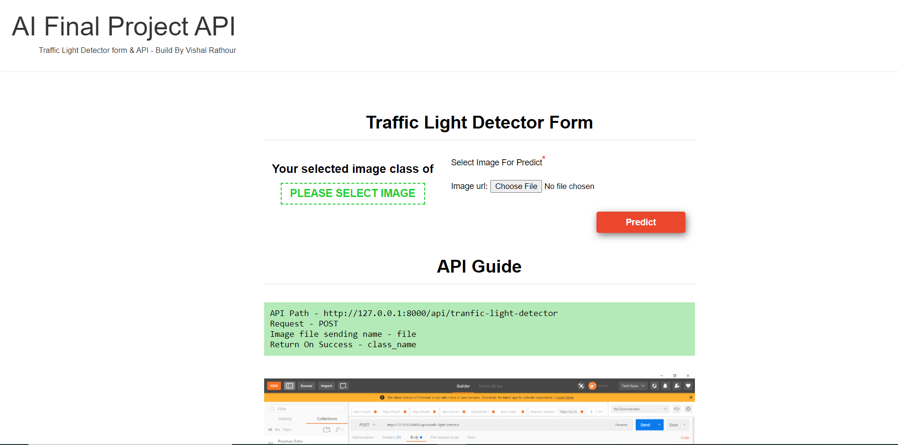
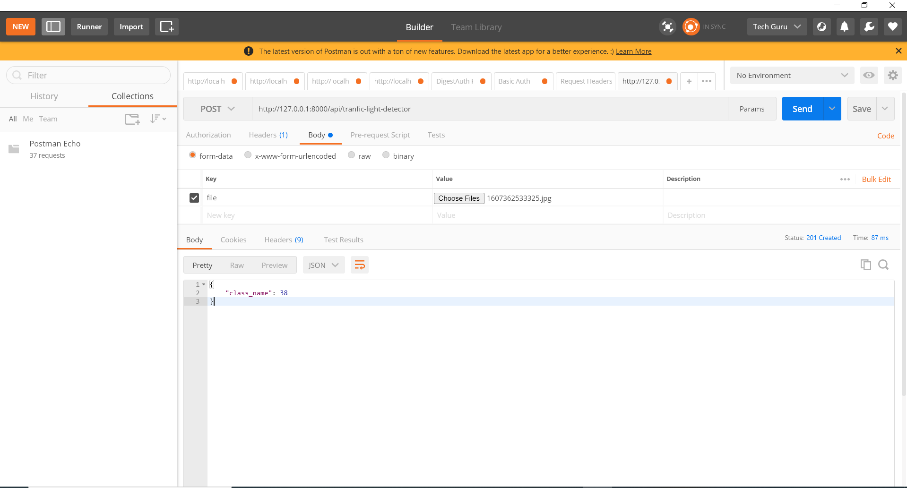

# traffic-light-detector

this project build on django and tensorflow, keras (CNN) with BelgiumTSC dataset.

first set project path than run commnad python manage.py runserver
download project from this url- https://drive.google.com/file/d/1j5x_HmmljJIvKLFTULGgOcO-QInBfb2E/view?usp=sharing

# you can pridict using of form or you can check with API
form view  

 
API view  

